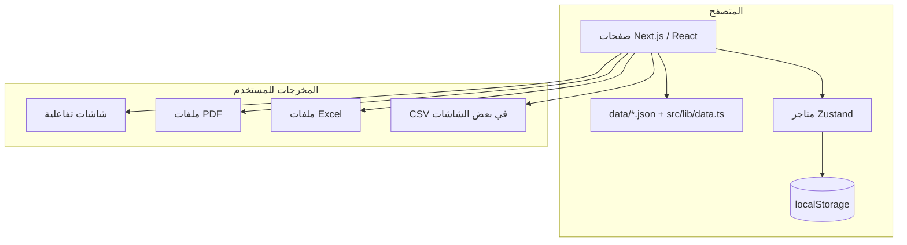

<!-- # مرجع نظام روز HR (Rose HR)

هذا الملف يوثّق **ما يفعله النظام**، **كيف يعمل تقنياً**، **أين توجد الوحدات**، و**ما المخرجات** (شاشات، ملفات، تخزين). الهدف أن يكون مرجعاً واحداً لفريق التطوير أو المنتج أو التشغيل.

---

## 1. نظرة عامة

**روز HR** (`rose-hr`) تطبيق ويب لإدارة الموارد البشرية باللغة العربية (واجهة RTL)، يجمع في مكان واحد:

- الهيكل التنظيمي والموظفين والحضور  
- الإجازات والطلبات الإدارية  
- الانضباط الوظيفي (مخالفات، إنذارات، تحقيقات، خصومات، تظلمات)  
- العقود وفترات الرواتب والسلف والتقارير المالية/الإدارية  

**الوضع الحالي للمنتج:** واجهة غنية بالوظائف مع **بيانات تجريبية (JSON)** لعرض اللوحات والجداول، و**لا يوجد خادم API** أو قاعدة بيانات حقيقية في المستودع. جزء كبير من البيانات «الديناميكية» يُحفظ في **متصفح المستخدم** عبر `localStorage` (انظر القسم 6).

---

## 2. التقنيات الأساسية

| الطبقة | التقنية |
|--------|---------|
| الإطار | [Next.js](https://nextjs.org/) 16 (App Router) |
| الواجهة | React 19، TypeScript |
| التنسيق | Tailwind CSS 4، مكوّنات Radix UI |
| الحالة | [Zustand](https://github.com/pmndrs/zustand) مع `persist` حيث يلزم |
| النماذج | `react-hook-form` + `zod` |
| الجداول / الرسوم | `@tanstack/react-table`، `recharts` |
| الخرائط | Leaflet / react-leaflet (نقاط تسجيل الحضور وغيرها) |
| PDF | `@react-pdf/renderer` + خطوط عربية (`ensure-hr-pdf-fonts`) |
| Excel | مكتبة `xlsx` (تصدير مسيرات الرواتب)، ودوال `download-xlsx` للجداول |

**نقطة الدخول:** `/login` → بعد الإرسال يُحاكى تأخير ثم التوجيه إلى `/dashboard` (لا يوجد تحقق حقيقي من الهوية على الخادم).

---

## 3. مخطط عالي المستوى (كيف يعمل النظام)



- **قراءة ثابتة:** شركات، فروع، أقسام، موظفين، عينات حضور ورواتب من `data/*.json` عبر `src/lib/data.ts`.  
- **قراءة/كتابة تفاعلية:** طلبات HR، انضباط، عقود، حضور، إجازات، إشعارات… عبر متاجر في `src/lib/**` مع **استمرارية** في `localStorage` لكل مفتاح تخزين خاص بالوحدة.

---

## 4. هيكل المشروع (أهم المسارات)

| المسار | الدور |
|--------|--------|
| `src/app/` | تعريف المسارات (صفحات App Router)، `layout.tsx` للتطبيق، `login/` |
| `src/app/(app)/` | الصفحات داخل الإطار العام (شريط علوي، لوحة تصفية، إلخ) |
| `src/components/` | مكوّنات واجهة قابلة لإعادة الاستخدام، تقارير PDF، خرائط |
| `src/lib/` | منطق الأعمال، المتاجر، الأنواع، أدوات التصدير والـ PDF |
| `data/` | ملفات JSON تجريبية (`mock-data`, `attendance`, `requests`, `payroll`) |

---

## 5. التنقل في الواجهة (ما الذي يمكن للمستخدم فتحه)

التنقل مُعرّف في `src/components/topbar.tsx` (سطح المكتب) و`src/components/sidebar.tsx` (الجوال). الملخص:

### 5.1 الرئيسية والهيكل

| المسار | الوظيفة |
|--------|---------|
| `/dashboard` | لوحة تحكم: مؤشرات حضور، طلبات معلقة، عقود، إجازات، مخالفات قيد المراجعة (مزيج من JSON + متاجر) |
| `/employees` | سجل الموظفين من البيانات التجريبية، تصفية، تصدير PDF/XLSX |
| `/employees/[id]` | بطاقة موظف (تفاصيل من `mock-data`) |
| `/branches` | إدارة/عرض الفروع |
| `/departments` | الأقسام |
| `/organization` | الهيكل التنظيمي |

### 5.2 الحضور

| المسار | الوظيفة |
|--------|---------|
| `/attendance?section=daily` | إدارة الحضور اليومي، أحداث، ملخصات أيام، **تصدير PDF/XLSX** |
| `/attendance?section=assignment` | ربط قوالب الشفت بالموظفين/الفروع… |
| `/attendance?section=checkpoint-links` | ربط نقاط التسجيل بالموظفين |
| `/attendance?section=templates` | قوالب الشفت |
| `/attendance?section=checkpoints` | نقاط التسجيل الجغرافية (خرائط) |

**التخزين:** `useAttendanceStore` — مفتاح مثل `rose-hr-attendance-v5`.

### 5.3 الإجازات

| المسار | الوظيفة |
|--------|---------|
| `/hr/leaves/analytics` | تحليلات ورسوم بيانية |
| `/hr/leaves/unified-management` | إدارة موحّدة لطلبات الإجازات |
| `/hr/leaves/unified-management/balance-credit` | إضافة رصيد إجازات |
| `/hr/leaves/leave-types` | أنواع الإجازات (`[section]` ديناميكي) |
| `/hr/leaves/public-holidays` | العطل الرسمية |

**التخزين:** متاجر في `src/lib/leaves/` (مثلاً `store.ts`, `leave-balance-credit-store.ts`).

### 5.4 الطلبات الإدارية (HR Requests)

| المسار | الوظيفة |
|--------|---------|
| `/hr/requests/general` | طلبات عامة، جدول، موافقات، **PDF/XLSX** |
| `/hr/requests/attendance-corrections` | طلبات تصحيح الحضور |
| `/hr/requests/request-types` | أنواع الطلبات حسب الأقسام والنماذج |
| `/hr/requests/form-templates` | قوالب حقول النماذج |
| `/hr/requests/approval-assignment` | إسناد مسارات الموافقة لأنواع الطلبات |
| `/hr/requests/[department]/[requestType]` | نموذج طلب حسب القسم والنوع |

**ملاحظة:** `/hr/requests/table` يعيد التوجيه إلى `/hr/requests/general`.

**التخزين:** `configuration-store`, `submissions-store`, `approval-assignment-store`, `attendance-correction-store`, `employee-directory-store`، إلخ.

### 5.5 الانضباط الوظيفي

جميع الشاشات تحت `/hr/discipline/[section]` حيث `section` أحد:

| القسم (`slug`) | العربية | ماذا يفعل |
|----------------|---------|-----------|
| `violation-types` | أنواع المخالفات | تعريف المخالفة، خصومات، حاجة لتحقيق/موافقة |
| `approval-assignment` | إسناد الموافقات | ربط قوالب الموافقين بأنواع المخالفات |
| `violation-cases` | تسجيل المخالفات | مسار حالة: مسودة → تقديم → اعتماد → تنفيذ… **PDF/XLSX** |
| `notices` | الإنذارات والتحذيرات | شفهي / أول / ثانٍ / نهائي — **PDF/XLSX** |
| `circulars` | التعميمات | جمهور: الكل، موظفون، فرع، قسم + إرسال |
| `investigations` | التحقيقات | مرتبطة بقضايا — **PDF/XLSX** |
| `deductions` | كشف الخصومات | ربط بالرواتب |
| `appeals` | التظلمات | قنوات ومراحل — **PDF/XLSX** |
| `audit-log` | سجل العمليات | تدقيق — **PDF** |

**التخزين:** مجموعة متاجر في `src/lib/hr-discipline/*-store.ts`.

### 5.6 الرواتب والعقود

| المسار | الوظيفة |
|--------|---------|
| `/hr/contracts/payroll-periods` | فترات الرواتب، حالات الإغلاق، ربط بالمسير |
| `/hr/contracts/employee-advances` | سلف الموظفين، **تصدير CSV** |
| `/hr/contracts/employment` | عقود العمل (من المتجر المستمر) |
| `/hr/contracts/articles` | مواد العقود والبدلات |
| `/hr/contracts/reports` | كشف مسيرات: **PDF** (مسير، إيصال نقدي، براءة ذمة) + **Excel** للفترة |
| `/hr/contracts/period/[periodId]` | تفاصيل فترة (حسب التوجيهات من الصفحات الفرعية) |
| `/hr/contracts/period/[periodId]/compensation` | معاينة/تقرير تعويضات للفترة |
| `/payroll/receipt` | إيصال راتب لموظف وشهر: **معاينة PDF + تحميل** |

جذر `/hr/contracts` يعيد التوجيه إلى `/hr/contracts/employment`.

**قوالب العقود:** `contract-templates-store` — بيانات أولية في الذاكرة فقط (بدون `persist` في الملف الحالي).

### 5.7 الصلاحيات والإعدادات والإشعارات

| المسار | الوظيفة |
|--------|---------|
| `/permissions` | مصفوفة أدوار وصلاحيات (واجهة تفاعلية؛ **ليست مربوطة بخادم**) |
| `/settings` | إعدادات عامة للتطبيق |
| `/notifications` | مركز الإشعارات من المتجر + **تصدير PDF** |
| شريط العلوي | جرس إشعارات (`NotificationBellPopover`) |

---

## 6. تخزين البيانات: ماذا يحدث عند التشغيل؟

### 6.1 بيانات تجريبية ثابتة (قراءة)

- **`data/mock-data.json`:** شركة، فروع، أقسام، موظفين، شفتات، نقاط جغرافية، أنشطة، أدوار.  
- **`data/attendance.json`:** عينات `attendanceToday` واتجاهات.  
- **`data/requests.json`:** طلبات وإحصائيات للوحة.  
- **`data/payroll.json`:** مسير حالي، تاريخ، كشوف، اتجاهات، حسب فرع.  

يُجمَع ذلك في `src/lib/data.ts` ككائن `data` ودوال مساعدة `getEmployee` / `getBranch` / `getDepartment`.

### 6.2 استمرارية في المتصفح (Zustand + localStorage)

أمثلة على الوحدات التي تُحدَّث أثناء الاستخدام وتُحفظ محلياً (أسماء المفاتيح داخل كل `store`):

- الحضور، الإجازات، الطلبات والتقديمات، تصحيح الحضور، دليل الموظفين في HR  
- الانضباط بالكامل (قضايا، إنذارات، تعميمات، تحقيقات، عقوبات، خصومات، تظلمات، سجل تدقيق، أنواع مخالفات، إسناد موافقات)  
- العقود، فترات الرواتب، السلف، مواد العقود، أنواع البدلات  
- الإشعارات  

**النتيجة:** كل مستخدم يرى «نسخته» من البيانات المعدّلة على نفس المتصفح؛ مسح بيانات الموقع يعيد الوضع الافتراضي للمتاجر (حسب منطق `migrate` و`seed` في كل ملف).

---

## 7. المخرجات (Outputs) — ماذا «يخرج» النظام للمستخدم؟

### 7.1 شاشات وتقارير داخل التطبيق

- جداول قابلة للتصفية والفرز والترقيم (pagination) في معظم الوحدات.  
- لوحات ورسوم (`dashboard`, تحليلات الإجازات، إلخ).  
- معاينات PDF مضمّنة (`PDFViewer`) أو حوار معاينة (`PdfPreviewExportDialog`).  
- خرائط لنقاط التسجيل وربط الموظفين (Leaflet).

### 7.2 ملفات للتنزيل

| النوع | أين يظهر (أمثلة) |
|-------|-------------------|
| **PDF** | سجل الموظفين، الحضور، الطلبات العامة، الإنذارات، المخالفات، التحقيقات، التظلمات، سجل الانضباط، الإشعارات، تقارير الرواتب (مسير / إيصال نقدي / براءة ذمة)، إيصال الراتب |
| **Excel (.xlsx)** | الموظفون، الحضور، الطلبات، عناصر الانضباط أعلاه، مسير الرواتب من مستكشف الفترات |
| **CSV** | سلف الموظفين |

### 7.3 مخرجات «منطقية» (سلوك النظام)

- تحديث حالات الطلبات والموافقات متعددة المراحل (تسلسلي، متوازي، اختياري… — مُعرَّف في الأنواع).  
- تحديث حالات قضايا المخالفات وسلسلة الموافقين.  
- إنشاء إشعارات عند أحداث (حسب `notifications-store` والمكوّنات التي تستدعيه).  
- احتساب/عرض معاينات التعويضات والرواتب من بيانات المتاجر والـ JSON.

---

## 8. مكوّنات مشتركة مهمة

- **`AppLayout`:** `Topbar` + `Sidebar` + `FilterPanel` + `AppEntityFilterRegion` + `Toaster`.  
- **تصفية الكيانات:** `EntityFilterToolbar` + سياقات `filter-panel` و`entity-filter-slot` لعرض أشرطة تصفية متناسقة بين الصفحات.  
- **العناوين:** `useSetPageTitle` / `PageTitleProvider` لعنوان الصفحة في الشريط العلوي.  
- **الـ PDF العربي:** تسجيل خطوط في `src/lib/pdf/ensure-hr-pdf-fonts.ts` وأنماط موحّدة في `hr-pdf-base-styles.ts`.

---

## 9. قيود الوضع الحالي (للمرجعية)

1. **لا يوجد backend:** لا REST ولا GraphQL ولا مصادقة خادم؛ تسجيل الدخول تجريبي.  
2. **الصلاحيات في `/permissions`:** واجهة إدارة أدوار؛ لا تُفرض على المسارات في الكود كـ middleware.  
3. **موظفو «السجل» في `/employees`:** من `data.employees`؛ **دليل HR الموسّع** (`employee-tab` ومسارات أخرى) قد يستخدم المتجر المنفصل.  
4. **البيئة الإنتاجية:** تحتاج ربط API، قاعدة بيانات، مصادقة، ونسخ احتياطي بدلاً من الاعتماد على `localStorage` فقط.

---

## 10. أوامر التشغيل المحلية

```bash
npm install
npm run dev    # خادم التطوير Next.js
npm run build  # بناء إنتاج
npm run start  # تشغيل بعد البناء
npm run lint   # ESLint
```

---

## 11. ملخص سريع «ماذا يجري؟»

1. المستخدم يفتح التطبيق ويتصفح الصفحات.  
2. الجزء «الثابت» من الأرقام والقوائم يأتي من **JSON**.  
3. أي إضافة/تعديل/موافقة في الوحدات الديناميكية يمر عبر **Zustand** ويُكتب في **localStorage**.  
4. عند الطلب، يُبنى **PDF أو Excel أو CSV** في المتصفح ويُعرض للمعاينة أو التنزيل.

---

*آخر تحديث للوثيقة وفق هيكل المستودع الحالي. عند إضافة وحدات أو API جديدة، يُنصح بتحديث الأقسام 5–7 وربطها بمسارات الملفات الفعلية.* -->
