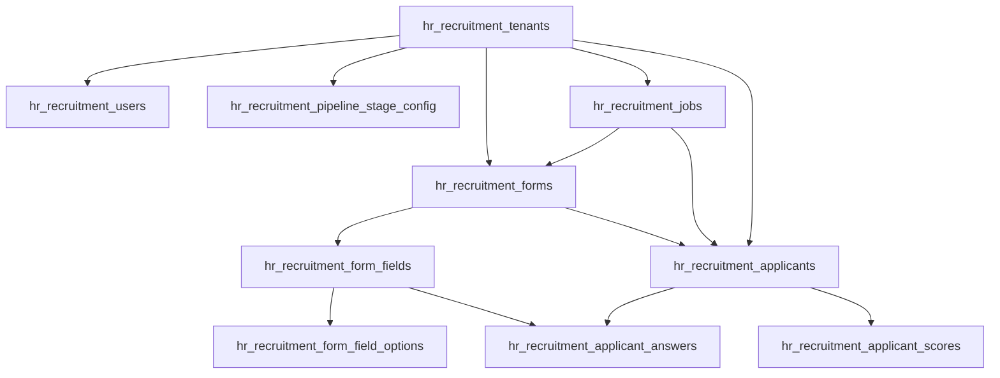

# ترتيب إدخال بيانات موديول التوظيف (HR Recruitment)

هذا الملف يوضّح **ترتيب ملء الجداول** حسب علاقات المفاتيح الأجنبية (Foreign Keys)، حتى لا تفشل عمليات الإدراج بسبب مراجع غير موجودة.

---

## مخطط العلاقات



---

## الترتيب الإلزامي (من الأ root إلى الأوراق)

| # | الجدول | يعتمد على | ملاحظة |
|---|--------|-----------|--------|
| **1** | `hr_recruitment_tenants` | — | **ابدأ هنا دائماً.** جذر الـ multi-tenant للتوظيف |
| **2** | `hr_recruitment_users` | `tenant_id` → tenants | اختياري — حسابات ATS (admin / recruiter / viewer) |
| **2** | `hr_recruitment_pipeline_stage_config` | `tenant_id` → tenants | اختياري — تسميات وألوان مراحل الـ Kanban |
| **3** | `hr_recruitment_jobs` | `tenant_id` → tenants | الوظائف الشاغرة |
| **4** | `hr_recruitment_forms` | `tenant_id` + `job_id` (1:1) | نموذج التقديم — **وظيفة واحدة = نموذج واحد** |
| **5** | `hr_recruitment_form_fields` | `form_id` → forms | حقول النموذج (text, select, …) |
| **6** | `hr_recruitment_form_field_options` | `field_id` → form_fields | فقط لحقول من نوع `select` |
| **7** | `hr_recruitment_applicants` | `tenant_id` + `job_id` + `form_id` | المتقدمون |
| **8** | `hr_recruitment_applicant_answers` | `applicant_id` + `field_id` | إجابات النموذج |
| **8** | `hr_recruitment_applicant_scores` | `applicant_id` → applicants | اختياري — يُنشأ عند التقييم (score) |

> **الخطوة 2** (users و pipeline_stage_config) مستقلة عن بعضها — يمكن إدخالهما بأي ترتيب بعد الـ tenant.  
> **الخطوة 8** (answers و scores) مستقلة — كلاهما يحتاج applicant فقط.

---

## مسار minimal لأول تجربة (Seed أساسي)

الحد الأدنى لتشغيل بوابة التقديم العام:

```
1. hr_recruitment_tenants
2. hr_recruitment_jobs          ← tenant_id مطلوب
3. hr_recruitment_forms         ← job_id + tenant_id
4. hr_recruitment_form_fields   ← form_id
5. (hr_recruitment_form_field_options)  ← إن وُجدت حقول select
```

بعدها يمكن استقبال متقدمين عبر:

- `POST /public/recruitment/jobs/:slug/apply`

---

## مسار كامل (بيانات تشغيلية)

```
1.  hr_recruitment_tenants
2.  hr_recruitment_users                    [اختياري]
3.  hr_recruitment_pipeline_stage_config     [اختياري — لكن مفيد للواجهة]
4.  hr_recruitment_jobs
5.  hr_recruitment_forms
6.  hr_recruitment_form_fields
7.  hr_recruitment_form_field_options       [حسب الحاجة]
8.  hr_recruitment_applicants
9.  hr_recruitment_applicant_answers
10. hr_recruitment_applicant_scores         [اختياري — بعد score API]
```

---

## إدخال عبر API (بدون SQL يدوي)

| الترتيب | Endpoint | ما يُنشأ تلقائياً |
|---------|----------|-------------------|
| 1 | *(لا يوجد endpoint عام للـ tenant حالياً)* | tenant يدوي أو seeder |
| 2 | `POST /recruitment/jobs` | **job + form + fields + options** في transaction واحدة |
| 3 | `PUT /recruitment/pipeline-stages` | يستبدل إعدادات مراحل الـ tenant |
| 4 | `POST /public/recruitment/jobs/:slug/apply` | **applicant + answers** |
| 5 | `POST /recruitment/applicants/:id/score` | **applicant_scores** |

> **ملاحظة:** إنشاء الوظيفة عبر API يدمج الخطوات 4–7 (job → form → fields → options) دفعة واحدة.

---

## أمثلة SQL (ترتيب الإدراج)

### 1 — Tenant

```sql
INSERT INTO hr_recruitment_tenants (id, name, slug, logo)
VALUES (
  '11111111-1111-1111-1111-111111111111',
  'شركة التوظيف',
  'acme-hr',
  NULL
);
```

### 2 — Pipeline stages (اختياري)

```sql
INSERT INTO hr_recruitment_pipeline_stage_config
  (id, tenant_id, stage, label, color, sort_order)
VALUES
  (gen_random_uuid(), '11111111-1111-1111-1111-111111111111', 'applied',    'تقديم',     '#64748b', 0),
  (gen_random_uuid(), '11111111-1111-1111-1111-111111111111', 'screening',  'فرز',       '#0ea5e9', 1),
  (gen_random_uuid(), '11111111-1111-1111-1111-111111111111', 'interview',  'مقابلة',    '#8b5cf6', 2),
  (gen_random_uuid(), '11111111-1111-1111-1111-111111111111', 'hired',      'تم التعيين','#16a34a', 5);
```

### 3 — Job

```sql
INSERT INTO hr_recruitment_jobs
  (id, tenant_id, title, slug, description, department, location, type, is_active)
VALUES (
  '22222222-2222-2222-2222-222222222222',
  '11111111-1111-1111-1111-111111111111',
  'مهندس برمجيات',
  'software-engineer',
  'وصف الوظيفة...',
  'تقنية المعلومات',
  'عمان',
  'full-time',
  true
);
```

### 4 — Form (مرتبط بالوظيفة)

```sql
INSERT INTO hr_recruitment_forms
  (id, tenant_id, job_id, title, description)
VALUES (
  '33333333-3333-3333-3333-333333333333',
  '11111111-1111-1111-1111-111111111111',
  '22222222-2222-2222-2222-222222222222',
  'نموذج التقديم',
  ''
);
```

### 5 — Form fields

```sql
INSERT INTO hr_recruitment_form_fields
  (id, form_id, type, label, required, sort_order)
VALUES
  ('44444444-4444-4444-4444-444444444441', '33333333-3333-3333-3333-333333333333', 'text', 'الاسم الكامل', true, 0),
  ('44444444-4444-4444-4444-444444444442', '33333333-3333-3333-3333-333333333333', 'text', 'البريد الإلكتروني', true, 1);
```

### 6 — Applicant + answers

```sql
INSERT INTO hr_recruitment_applicants
  (id, tenant_id, job_id, form_id, pipeline_stage, submitted_at)
VALUES (
  '55555555-5555-5555-5555-555555555555',
  '11111111-1111-1111-1111-111111111111',
  '22222222-2222-2222-2222-222222222222',
  '33333333-3333-3333-3333-333333333333',
  'applied',
  now()
);

INSERT INTO hr_recruitment_applicant_answers (id, applicant_id, field_id, value)
VALUES
  (gen_random_uuid(), '55555555-5555-5555-5555-555555555555', '44444444-4444-4444-4444-444444444441', 'أحمد محمد'),
  (gen_random_uuid(), '55555555-5555-5555-5555-555555555555', '44444444-4444-4444-4444-444444444442', 'ahmed@example.com');
```

---

## قواعد CASCADE عند الحذف

| حذف من | يُحذف تلقائياً |
|--------|----------------|
| `hr_recruitment_tenants` | users, jobs, forms, applicants, pipeline config, … |
| `hr_recruitment_jobs` | form (1:1), applicants |
| `hr_recruitment_forms` | form_fields → options, applicants |
| `hr_recruitment_applicants` | answers, scores |

---

## ملخص سريع

```
tenants
  ├── users              (اختياري)
  ├── pipeline_stage_config (اختياري)
  └── jobs
        └── forms
              └── form_fields
                    └── form_field_options (select فقط)
        └── applicants
              ├── applicant_answers
              └── applicant_scores (اختياري)
```

**القاعدة الذهبية:** لا تُدخل صفاً قبل وجود كل الـ `*_id` التي يشير إليها.

---

# واجهة الفرونت إند — دوال API كاملة

> مرجع التنفيذ: controllers في `src/modules/hr-recruitment/`  
> **Envelope:** كل استجابة JSON ناجحة (ما عدا 204) بالشكل `{ status, message, data, error }` حيث `data` يحمل المحتوى أدناه.

## Enums

```typescript
type RecruitmentJobType = 'full-time' | 'part-time' | 'contract' | 'internship';

type RecruitmentPipelineStage =
  | 'applied'
  | 'screening'
  | 'interview'
  | 'technical'
  | 'offer'
  | 'hired'
  | 'rejected';

type RecruitmentFormFieldType = 'text' | 'number' | 'select' | 'file';
```

## Types — Response

```typescript
interface RecruitmentTenant {
  id: string;
  name: string;
  slug: string;
  logo: string | null;
  createdAt: string; // ISO date
}

interface RecruitmentFormField {
  id: string;
  type: RecruitmentFormFieldType;
  label: string;
  required: boolean;
  options?: string[];       // select فقط
  sortOrder: number;
}

interface RecruitmentForm {
  id: string;
  tenantId: string;
  jobId: string;
  title: string;
  description: string;
  fields: RecruitmentFormField[];
  createdAt: string;
  updatedAt: string;
}

interface RecruitmentJob {
  id: string;
  tenantId: string;
  title: string;
  slug: string;               // يُولَّد تلقائياً من title
  description: string;
  department: string;
  location: string;
  type: RecruitmentJobType;
  isActive: boolean;
  formId: string;
  createdAt: string;
  updatedAt: string;
}

interface RecruitmentJobDetail extends RecruitmentJob {
  form: RecruitmentForm;
}

interface RecruitmentApplicantScore {
  ruleScore: number;
  aiScore: number;
  finalScore: number;
  reasoning: string;
  scoredAt: string;
}

interface RecruitmentApplicant {
  id: string;
  tenantId: string;
  jobId: string;
  formId: string;
  answers: Record<string, string | undefined>; // fieldId → value
  cvFileName: string | null;
  cvFilePath: string | null;
  pipelineStage: RecruitmentPipelineStage;
  score: RecruitmentApplicantScore | null;
  submittedAt: string;
  createdAt: string;
  updatedAt: string;
}

interface RecruitmentPipelineStageConfig {
  stage: RecruitmentPipelineStage;
  label: string;
  color: string;
  sortOrder: number;
}

interface RecruitmentJobStats {
  jobId: string;
  totalApplicants: number;
  hiredCount: number;
  stageCounts: Record<RecruitmentPipelineStage, number>;
}

interface PaginationMeta {
  page: number;
  limit: number;
  total: number;
  totalPages: number;
}

interface PaginatedResult<T> {
  items: T[];
  pagination: PaginationMeta;
}

interface PublicRecruitmentJob {
  job: RecruitmentJob;
  form: RecruitmentForm;
}
```

## Types — Request (Body / Query)

```typescript
// ── Pagination (مشترك) ──
interface PaginationQuery {
  page?: number;   // default 1
  limit?: number;  // default 200
}

// ── Tenant (⚠️ لا يوجد controller بعد — للتخطيط) ──
interface CreateRecruitmentTenantDto {
  name: string;
  slug?: string;      // يُولَّد من name إن حُذف
  logo?: string | null;
}

// ── Job ──
interface RecruitmentFormFieldInput {
  id?: string;        // عند التحديث فقط (حالياً replace كامل للحقول)
  type: RecruitmentFormFieldType;
  label: string;
  required: boolean;
  options?: string[]; // select فقط
  sortOrder?: number;
}

interface RecruitmentFormInput {
  title: string;
  description?: string;
  fields: RecruitmentFormFieldInput[];
}

interface CreateRecruitmentJobDto {
  tenantId: string;
  title: string;
  description?: string;
  department: string;
  location?: string;
  type: RecruitmentJobType;
  isActive?: boolean; // default true
  form: RecruitmentFormInput;
}

interface UpdateRecruitmentJobDto {
  title?: string;
  description?: string;
  department?: string;
  location?: string;
  type?: RecruitmentJobType;
  isActive?: boolean;
  form?: RecruitmentFormInput;
}

interface ListRecruitmentJobsQuery extends PaginationQuery {
  tenantId: string;   // مطلوب
  search?: string;    // ILIKE على title, department, location
  isActive?: boolean;
}

// ── Form (منفصل عن Job) ──
interface UpdateRecruitmentFormDto {
  title?: string;
  description?: string;
  fields?: RecruitmentFormFieldInput[];
}

// ── Applicant ──
interface ListRecruitmentApplicantsQuery extends PaginationQuery {
  tenantId: string;   // مطلوب
  jobId?: string;
  pipelineStage?: RecruitmentPipelineStage;
  minScore?: number;
  search?: string;    // ILIKE على answers.value أو cvFileName
}

interface SubmitRecruitmentApplicationDto {
  answers: Record<string, string>; // fieldId → value
  cvFileName?: string | null;
  cvFileBase64?: string | null;  // placeholder — غير مخزّن بعد
}

interface MoveApplicantStageDto {
  pipelineStage: RecruitmentPipelineStage;
}

// ── Pipeline stages ──
interface RecruitmentPipelineStageConfigItem {
  stage: RecruitmentPipelineStage;
  label: string;
  color: string;
  sortOrder: number;
}

interface UpdateRecruitmentPipelineStagesDto {
  tenantId: string;
  stages: RecruitmentPipelineStageConfigItem[];
}

interface ListRecruitmentPipelineStagesQuery {
  tenantId: string;
}
```

---

## 1. Tenants — `hr_recruitment_tenants`

| العملية | HTTP | Endpoint | الحالة |
|---------|------|----------|--------|
| إنشاء | POST | `/recruitment/tenants` | ⚠️ **غير منفّذ** (service فقط) |
| قائمة | GET | `/recruitment/tenants` | ⚠️ **غير منفّذ** |
| جلب بالـ id | GET | `/recruitment/tenants/:id` | ⚠️ **غير منفّذ** |
| تعديل | PATCH | `/recruitment/tenants/:id` | ⚠️ **غير منفّذ** |
| حذف | DELETE | `/recruitment/tenants/:id` | ⚠️ **غير منفّذ** |

**Create body:** `CreateRecruitmentTenantDto`  
**Response:** `RecruitmentTenant`

> حتى يُنفَّذ الـ controller: أنشئ tenant عبر SQL/Seeder واحتفظ بـ `tenantId` في الفرونت.

---

## 2. Jobs — `hr_recruitment_jobs` (+ form مدمج)

**Auth:** Bearer JWT  
**صلاحيات:** `hr.recruitment.jobs.read|create|update|delete`

### `recruitmentApi.listJobs`

```typescript
GET /recruitment/jobs?tenantId={uuid}&page=1&limit=20&search=&isActive=true
→ PaginatedResult<RecruitmentJob>
```

| Query | نوع | مطلوب | وصف |
|-------|-----|-------|-----|
| `tenantId` | uuid | ✅ | فلترة حسب tenant |
| `page` | number | | صفحة (1+) |
| `limit` | number | | حجم الصفحة |
| `search` | string | | بحث في title, department, location |
| `isActive` | boolean | | وظائف نشطة/معطّلة فقط |

---

### `recruitmentApi.getJob`

```typescript
GET /recruitment/jobs/:id
→ RecruitmentJobDetail   // job + form + fields
```

---

### `recruitmentApi.getJobBySlug`

```typescript
GET /recruitment/jobs/by-slug/:slug
→ RecruitmentJobDetail
```

> يعيد الوظيفة حتى لو غير نشطة (لوحة الإدارة). للعامة استخدم Public API.

---

### `recruitmentApi.createJob`

```typescript
POST /recruitment/jobs
Body: CreateRecruitmentJobDto
→ RecruitmentJobDetail   // 201 — ينشئ job + form + fields + options دفعة واحدة
```

**Body — كل الحقول:**

| حقل | نوع | مطلوب |
|-----|-----|-------|
| `tenantId` | uuid | ✅ |
| `title` | string | ✅ |
| `description` | string | |
| `department` | string | ✅ |
| `location` | string | |
| `type` | RecruitmentJobType | ✅ |
| `isActive` | boolean | |
| `form.title` | string | ✅ |
| `form.description` | string | |
| `form.fields[]` | array | ✅ |
| `form.fields[].type` | RecruitmentFormFieldType | ✅ |
| `form.fields[].label` | string | ✅ |
| `form.fields[].required` | boolean | ✅ |
| `form.fields[].options` | string[] | select |
| `form.fields[].sortOrder` | number | |

---

### `recruitmentApi.updateJob`

```typescript
PATCH /recruitment/jobs/:id
Body: UpdateRecruitmentJobDto   // كل الحقول اختيارية
→ RecruitmentJobDetail
```

> إذا أُرسل `form.fields` يُستبدل **كل** الحقول (delete + insert).

---

### `recruitmentApi.toggleJobActive`

```typescript
PATCH /recruitment/jobs/:id/toggle-active
Body: (فارغ)
→ RecruitmentJobDetail
```

---

### `recruitmentApi.deleteJob`

```typescript
DELETE /recruitment/jobs/:id
→ 204 No Content
```

---

### `recruitmentApi.getJobStats`

```typescript
GET /recruitment/jobs/:id/stats
→ RecruitmentJobStats
```

**Response fields:** `jobId`, `totalApplicants`, `hiredCount`, `stageCounts`

---

### `recruitmentApi.getJobApplicants`

```typescript
GET /recruitment/jobs/:id/applicants
→ RecruitmentApplicant[]   // بدون pagination
```

---

### `recruitmentApi.getJobPipeline`

```typescript
GET /recruitment/jobs/:id/pipeline
→ Record<RecruitmentPipelineStage, RecruitmentApplicant[]>
```

مثال:

```json
{
  "applied": [ { "...applicant" } ],
  "screening": [],
  "interview": [],
  "technical": [],
  "offer": [],
  "hired": [],
  "rejected": []
}
```

---

## 3. Forms — `hr_recruitment_forms` (+ fields + options)

**ملاحظة:** لا CRUD مستقل للحقول — مدمج في Job أو endpoints النموذج.

### `recruitmentApi.getFormByJobId`

```typescript
GET /recruitment/jobs/:jobId/form
→ RecruitmentForm
```

**صلاحية:** `hr.recruitment.jobs.read`

---

### `recruitmentApi.updateFormByJobId`

```typescript
PATCH /recruitment/jobs/:jobId/form
Body: UpdateRecruitmentFormDto
→ RecruitmentForm
```

**صلاحية:** `hr.recruitment.jobs.update`

| Body | نوع | وصف |
|------|-----|-----|
| `title` | string | |
| `description` | string | |
| `fields` | RecruitmentFormFieldInput[] | استبدال كامل |

---

## 4. Applicants — `hr_recruitment_applicants`

**Auth:** Bearer JWT (ما عدا Public apply)  
**صلاحيات:** `hr.recruitment.applicants.read|update|delete`

| العملية | HTTP | Endpoint | الحالة |
|---------|------|----------|--------|
| إنشاء (إدارة) | POST | `/recruitment/applicants` | ⚠️ **غير منفّذ** |
| تعديل إجابات | PATCH | `/recruitment/applicants/:id` | ⚠️ **غير منفّذ** |

---

### `recruitmentApi.listApplicants`

```typescript
GET /recruitment/applicants?tenantId={uuid}&jobId=&pipelineStage=&minScore=&search=&page=&limit=
→ PaginatedResult<RecruitmentApplicant>
```

| Query | نوع | مطلوب | وصف |
|-------|-----|-------|-----|
| `tenantId` | uuid | ✅ | |
| `jobId` | uuid | | فلترة وظيفة |
| `pipelineStage` | RecruitmentPipelineStage | | مرحلة pipeline |
| `minScore` | number | | `finalScore >= minScore` |
| `search` | string | | نص في الإجابات أو اسم CV |
| `page` | number | | |
| `limit` | number | | |

---

### `recruitmentApi.getApplicant`

```typescript
GET /recruitment/applicants/:id
→ RecruitmentApplicant
```

---

### `recruitmentApi.moveApplicantStage`

```typescript
PATCH /recruitment/applicants/:id/stage
Body: { pipelineStage: RecruitmentPipelineStage }
→ RecruitmentApplicant
```

**صلاحية:** `hr.recruitment.applicants.update`

---

### `recruitmentApi.scoreApplicant`

```typescript
POST /recruitment/applicants/:id/score
Body: (فارغ)
→ RecruitmentApplicantScore   // 201 — placeholder 0/0/0
```

**صلاحية:** `hr.recruitment.applicants.update`

---

### `recruitmentApi.deleteApplicant`

```typescript
DELETE /recruitment/applicants/:id
→ 204 No Content
```

**صلاحية:** `hr.recruitment.applicants.delete`

---

## 5. Pipeline stages — `hr_recruitment_pipeline_stage_config`

**Auth:** Bearer JWT  
**صلاحيات:** `hr.recruitment.pipeline-stages.read|update`

| العملية | HTTP | Endpoint | الحالة |
|---------|------|----------|--------|
| إنشاء/حذف فردي | — | — | ⚠️ **PUT فقط** (استبدال كامل) |

---

### `recruitmentApi.listPipelineStages`

```typescript
GET /recruitment/pipeline-stages?tenantId={uuid}
→ RecruitmentPipelineStageConfig[]
```

---

### `recruitmentApi.updatePipelineStages`

```typescript
PUT /recruitment/pipeline-stages
Body: UpdateRecruitmentPipelineStagesDto
→ RecruitmentPipelineStageConfig[]
```

**Body:**

| حقل | نوع | مطلوب |
|-----|-----|-------|
| `tenantId` | uuid | ✅ |
| `stages[]` | array | ✅ |
| `stages[].stage` | RecruitmentPipelineStage | ✅ |
| `stages[].label` | string | ✅ |
| `stages[].color` | string | ✅ |
| `stages[].sortOrder` | number | ✅ |

> يحذف كل إعدادات الـ tenant ويُدخل المجموعة الجديدة.

---

## 6. Public — بوابة التقديم (بدون JWT)

### `publicRecruitmentApi.getPublicJob`

```typescript
GET /public/recruitment/jobs/:slug
→ PublicRecruitmentJob   // { job, form }
```

> **وظائف نشطة فقط** (`isActive = true`).

---

### `publicRecruitmentApi.submitApplication`

```typescript
POST /public/recruitment/jobs/:slug/apply
Body: SubmitRecruitmentApplicationDto
→ RecruitmentApplicant   // 201
```

**Body:**

| حقل | نوع | مطلوب | وصف |
|-----|-----|-------|-----|
| `answers` | Record\<fieldId, string\> | ✅ | إجابات النموذج |
| `cvFileName` | string \| null | | اسم ملف CV |
| `cvFileBase64` | string \| null | | غير مخزّن حالياً |

> يتحقق من الحقول `required` في النموذج.  
> `pipelineStage` يبدأ دائماً `applied`.

---

## 7. Users — `hr_recruitment_users`

| العملية | HTTP | Endpoint | الحالة |
|---------|------|----------|--------|
| كل العمليات | — | — | ⚠️ **لا API** — جدول placeholder |

> يُفضّل لاحقاً الربط بجدول `users` الرئيسي (انظر نقاش المعمارية).

---

## ملف عميل TypeScript جاهز للفرونت

```typescript
// recruitment.api.ts — غلاف HTTP (axios/fetch)

export const recruitmentApi = {
  // Jobs
  listJobs: (query: ListRecruitmentJobsQuery) =>
    GET<PaginatedResult<RecruitmentJob>>('/recruitment/jobs', query),

  getJob: (id: string) =>
    GET<RecruitmentJobDetail>(`/recruitment/jobs/${id}`),

  getJobBySlug: (slug: string) =>
    GET<RecruitmentJobDetail>(`/recruitment/jobs/by-slug/${slug}`),

  createJob: (dto: CreateRecruitmentJobDto) =>
    POST<RecruitmentJobDetail>('/recruitment/jobs', dto),

  updateJob: (id: string, dto: UpdateRecruitmentJobDto) =>
    PATCH<RecruitmentJobDetail>(`/recruitment/jobs/${id}`, dto),

  deleteJob: (id: string) =>
    DELETE(`/recruitment/jobs/${id}`),

  toggleJobActive: (id: string) =>
    PATCH<RecruitmentJobDetail>(`/recruitment/jobs/${id}/toggle-active`),

  getFormByJobId: (jobId: string) =>
    GET<RecruitmentForm>(`/recruitment/jobs/${jobId}/form`),

  updateFormByJobId: (jobId: string, dto: UpdateRecruitmentFormDto) =>
    PATCH<RecruitmentForm>(`/recruitment/jobs/${jobId}/form`, dto),

  getJobApplicants: (jobId: string) =>
    GET<RecruitmentApplicant[]>(`/recruitment/jobs/${jobId}/applicants`),

  getJobStats: (jobId: string) =>
    GET<RecruitmentJobStats>(`/recruitment/jobs/${jobId}/stats`),

  getJobPipeline: (jobId: string) =>
    GET<Record<RecruitmentPipelineStage, RecruitmentApplicant[]>>(
      `/recruitment/jobs/${jobId}/pipeline`,
    ),

  // Applicants
  listApplicants: (query: ListRecruitmentApplicantsQuery) =>
    GET<PaginatedResult<RecruitmentApplicant>>('/recruitment/applicants', query),

  getApplicant: (id: string) =>
    GET<RecruitmentApplicant>(`/recruitment/applicants/${id}`),

  deleteApplicant: (id: string) =>
    DELETE(`/recruitment/applicants/${id}`),

  moveApplicantStage: (id: string, dto: MoveApplicantStageDto) =>
    PATCH<RecruitmentApplicant>(`/recruitment/applicants/${id}/stage`, dto),

  scoreApplicant: (id: string) =>
    POST<RecruitmentApplicantScore>(`/recruitment/applicants/${id}/score`),

  // Pipeline
  listPipelineStages: (tenantId: string) =>
    GET<RecruitmentPipelineStageConfig[]>('/recruitment/pipeline-stages', { tenantId }),

  updatePipelineStages: (dto: UpdateRecruitmentPipelineStagesDto) =>
    PUT<RecruitmentPipelineStageConfig[]>('/recruitment/pipeline-stages', dto),
};

export const publicRecruitmentApi = {
  getPublicJob: (slug: string) =>
    GET<PublicRecruitmentJob>(`/public/recruitment/jobs/${slug}`),

  submitApplication: (slug: string, dto: SubmitRecruitmentApplicationDto) =>
    POST<RecruitmentApplicant>(`/public/recruitment/jobs/${slug}/apply`, dto),
};
```

---

## جدول ملخص — ما هو متاح vs مطلوب

| المورد | Create | Read | Update | Delete | فلاتر / جلب بدلالة |
|--------|--------|------|--------|--------|---------------------|
| **Tenant** | ⚠️ | ⚠️ | ⚠️ | ⚠️ | — |
| **Job** | ✅ POST | ✅ list/id/slug | ✅ PATCH + toggle | ✅ DELETE | tenantId, search, isActive, page, limit |
| **Form** | ✅ ضمن createJob | ✅ by jobId | ✅ PATCH form | ✅ ضمن deleteJob | jobId |
| **Form fields** | ✅ ضمن form | ✅ ضمن form | ✅ replace | ✅ replace | — |
| **Applicant** | ✅ public apply | ✅ list/id/by job/pipeline | ✅ stage, score | ✅ DELETE | tenantId, jobId, stage, minScore, search |
| **Answers** | ✅ public apply | ✅ ضمن applicant | ⚠️ | ✅ CASCADE | — |
| **Score** | ✅ POST score | ✅ ضمن applicant | ✅ replace score | ✅ CASCADE | minScore filter |
| **Pipeline config** | ✅ PUT | ✅ GET | ✅ PUT (replace) | ✅ PUT (replace) | tenantId |
| **ATS users** | ⚠️ | ⚠️ | ⚠️ | ⚠️ | — |

---

## صلاحيات الفرونت (RBAC)

| Endpoint group | Permission |
|----------------|------------|
| Jobs CRUD + stats + form read | `hr.recruitment.jobs.read` |
| Jobs create | `hr.recruitment.jobs.create` |
| Jobs update + form update + toggle | `hr.recruitment.jobs.update` |
| Jobs delete | `hr.recruitment.jobs.delete` |
| Applicants list/read/pipeline | `hr.recruitment.applicants.read` |
| Applicants stage + score | `hr.recruitment.applicants.update` |
| Applicants delete | `hr.recruitment.applicants.delete` |
| Pipeline stages | `hr.recruitment.pipeline-stages.read\|update` |
| Public apply | **بدون صلاحية** |

---

## ترتيب استدعاءات الفرونت (Onboarding)

```
1. tenantId (seed / SQL)
2. PUT /recruitment/pipeline-stages     ← إعداد Kanban
3. POST /recruitment/jobs               ← وظيفة + نموذج
4. GET  /recruitment/jobs?tenantId=     ← قائمة لوحة الإدارة
5. GET  /public/recruitment/jobs/:slug  ← صفحة عامة
6. POST /public/.../apply               ← تقديم
7. GET  /recruitment/jobs/:id/pipeline  ← Kanban
8. PATCH /recruitment/applicants/:id/stage
9. POST /recruitment/applicants/:id/score
```

